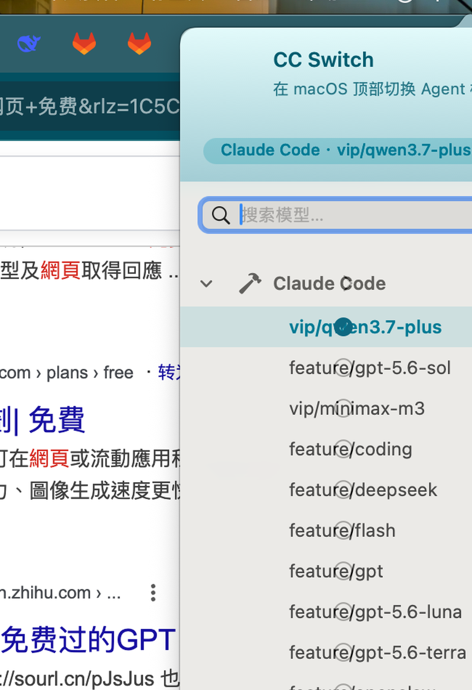

# BB Switch

BB Switch 是一个 macOS 菜单栏模型切换器，用于快速切换 Claude Code、Codex 和 OpenCode 的 Provider 与模型。



## 功能

- 原生 macOS 菜单，按 `Agent → Provider → 模型` 操作。
- 添加、编辑和删除 Provider。
- 通过 `GET /models` 获取模型，并选择需要展示的模型。
- Provider SK 保存在 macOS 钥匙串。
- 切换前可自动备份 Agent 配置。
- 支持 Apple 芯片和 Intel Mac，最低 macOS 12。

## 构建

需要安装 Xcode Command Line Tools：

```bash
make build    # 生成 build/BBSwitch.app
make run      # 启动应用
make package  # 生成 build/BBSwitch-universal.zip
make probe    # 检查 Agent 配置
make clean
```

## 使用

1. 启动 BBSwitch，点击菜单栏图标。
2. 展开 Agent，选择或添加 Provider。
3. 在 Provider 右侧菜单中选择模型。
4. 如果切换后未生效，请重新启动对应的 CLI。

## 配置位置

| Agent | 配置文件 |
| --- | --- |
| Claude Code | `~/.claude/settings.json` |
| Codex | `~/.codex/config.toml` |
| OpenCode | `~/.config/opencode/opencode.json` |

## 分发说明

`make package` 生成 Universal 2 压缩包。当前使用本地临时签名；公开分发需要 Developer ID 签名和 Apple 公证。
